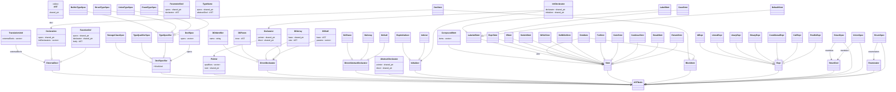
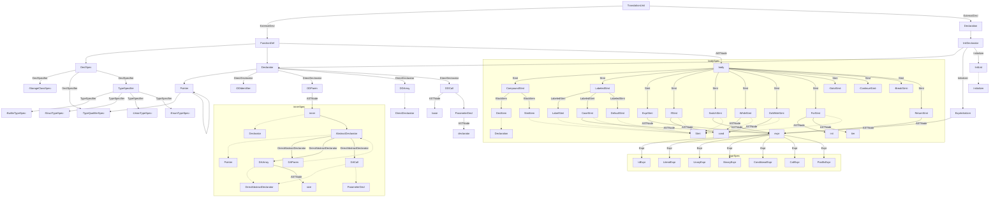

AST struct:

```mermaid
classDiagram

	%% Base
	class ASTNode {
	}
	class AST {
		<<alias>>
		shared_ptr<ASTNode>
	}

	%% Translation unit / external
	class ExternalDecl {
	}
	class TranslationUnit {
		externalDecls : vector<shared_ptr<ExternalDecl>>
	}
	ExternalDecl --|> ASTNode
	TranslationUnit --> ExternalDecl : externalDecls

	%% Decl specifiers
	class DeclSpecifier {
		+Kind kind
	}
	class StorageClassSpec
	class TypeQualifierSpec
	class TypeSpecifier
	class BuiltinTypeSpec
	class StructTypeSpec
	class UnionTypeSpec
	class EnumTypeSpec
	class DeclSpec {
		specs : vector<shared_ptr<DeclSpecifier>>
	}
	DeclSpecifier --|> ASTNode
	StorageClassSpec --|> DeclSpecifier
	TypeQualifierSpec --|> DeclSpecifier
	TypeSpecifier --|> DeclSpecifier
	BuiltinTypeSpec --|> TypeSpecifier
	StructTypeSpec --|> TypeSpecifier
	UnionTypeSpec --|> TypeSpecifier
	EnumTypeSpec --|> TypeSpecifier
	DeclSpec --> DeclSpecifier : specs

	%% Declarators
	class Pointer {
		qualifiers : vector<shared_ptr<TypeQualifierSpec>>
		next : shared_ptr<Pointer>
	}
	class DirectDeclarator
	class DDIdentifier {
		name : string
	}
	class DDParen {
		inner : AST
	}
	class DDArray {
		base : shared_ptr<DirectDeclarator>
		size : AST
	}
	class DDCall {
		base : AST
		params : vector<shared_ptr<ParameterDecl>>
	}
	class Declarator {
		pointer : shared_ptr<Pointer>
		direct : shared_ptr<DirectDeclarator>
	}
	Pointer --|> ASTNode
	DirectDeclarator --|> ASTNode
	DDIdentifier --|> DirectDeclarator
	DDParen --|> DirectDeclarator
	DDArray --|> DirectDeclarator
	DDCall --|> DirectDeclarator
	Declarator --> Pointer
	Declarator --> DirectDeclarator

	class ParameterDecl {
		specs : shared_ptr<DeclSpec>
		declarator : AST
	}

	%% Abstract declarators / type names
	class AbstractDeclarator {
		pointer : shared_ptr<Pointer>
		direct : shared_ptr<DirectAbstractDeclarator>
	}
	class DirectAbstractDeclarator
	class DAParen
	class DAArray
	class DACall
	class TypeName {
		specs : shared_ptr<DeclSpec>
		abstractDecl : AST
	}
	DirectAbstractDeclarator --|> ASTNode
	AbstractDeclarator --|> ASTNode
	DAParen --|> DirectAbstractDeclarator
	DAArray --|> DirectAbstractDeclarator
	DACall --|> DirectAbstractDeclarator

	%% Initializers
	class Initializer
	class ExprInitializer
	class InitList
	Initializer --|> ASTNode
	ExprInitializer --|> Initializer
	InitList --|> Initializer

	%% Declarations / definitions
	class InitDeclarator {
		declarator : shared_ptr<Declarator>
		initializer : shared_ptr<Initializer>
	}
	class Declaration {
		specs : shared_ptr<DeclSpec>
		initDeclarators : vector<shared_ptr<InitDeclarator>>
	}
	class FunctionDef {
		specs : shared_ptr<DeclSpec>
		declarator : shared_ptr<Declarator>
		body : AST
	}
	Declaration --|> ExternalDecl
	FunctionDef --|> ExternalDecl
	InitDeclarator --> Declarator
	InitDeclarator --> Initializer

	%% Statements
	class Stmt
	class BlockItem
	class DeclItem
	class StmtItem
	class CompoundStmt {
		items : vector<shared_ptr<BlockItem>>
	}
	Stmt --|> ASTNode
	BlockItem --|> ASTNode
	DeclItem --|> BlockItem
	StmtItem --|> BlockItem
	CompoundStmt --|> Stmt
	DeclItem --> Declaration : decl
	StmtItem --> Stmt : stmt

	class LabeledStmt
	class LabelStmt
	class CaseStmt
	class DefaultStmt
	LabeledStmt --|> Stmt
	LabelStmt --|> LabeledStmt
	CaseStmt --|> LabeledStmt
	DefaultStmt --|> LabeledStmt

	class ExprStmt
	ExprStmt --|> Stmt

	class IfStmt
	class SwitchStmt
	IfStmt --|> Stmt
	SwitchStmt --|> Stmt

	class WhileStmt
	class DoWhileStmt
	class ForStmt
	WhileStmt --|> Stmt
	DoWhileStmt --|> Stmt
	ForStmt --|> Stmt

	class GotoStmt
	class ContinueStmt
	class BreakStmt
	class ReturnStmt
	GotoStmt --|> Stmt
	ContinueStmt --|> Stmt
	BreakStmt --|> Stmt
	ReturnStmt --|> Stmt

	%% Expressions
	class Expr
	class IdExpr
	class LiteralExpr
	class UnaryExpr
	class BinaryExpr
	class ConditionalExpr
	class CallExpr
	class PostfixExpr
	Expr --|> ASTNode
	IdExpr --|> Expr
	LiteralExpr --|> Expr
	UnaryExpr --|> Expr
	BinaryExpr --|> Expr
	ConditionalExpr --|> Expr
	CallExpr --|> Expr
	PostfixExpr --|> Expr

	%% Struct/Union/Enum
	class StructDecl
	class StructSpec
	class UnionSpec
	class Enumerator
	class EnumSpec
	StructDecl --|> ASTNode
	StructSpec --|> ASTNode
	UnionSpec --|> ASTNode
	Enumerator --|> ASTNode
	EnumSpec --|> ASTNode

	%% Associations (high-level)
	StructSpec --> StructDecl : members
	UnionSpec --> StructDecl : members
	EnumSpec --> Enumerator : enumerators

```

ASTVisitor:

```mermaid
graph TD

TranslationUnit -->|ExternalDecl| FunctionDef
TranslationUnit -->|ExternalDecl| Declaration

FunctionDef --> DeclSpec
FunctionDef --> Declarator
FunctionDef -->|ASTNode| body

DeclSpec -->|DeclSpecifier| -StorageClassSpec-
DeclSpec -->|DeclSpecifier| -TypeQualifierSpec-
DeclSpec -->|DeclSpecifier| TypeSpecifier

TypeSpecifier -->|TypeSpecifier| -BuiltinTypeSpec-
TypeSpecifier -->|TypeSpecifier| -StructTypeSpec-
TypeSpecifier -->|TypeSpecifier| -UnionTypeSpec-
TypeSpecifier -->|TypeSpecifier| -EnumTypeSpec-

Declarator --> Pointer
Declarator -->|DirectDeclarator| -DDIdentifier-
Declarator -->|DirectDeclarator| DDParen
Declarator -->|DirectDeclarator| DDArray
Declarator -->|DirectDeclarator| DDCall

Pointer --> -TypeQualifierSpec-
Pointer --> Pointer

DDParen -->|ASTNode| inner

DDArray -.-> DirectDeclarator

DDCall -->|ASTNode| base
DDCall --> ParameterDecl

ParameterDecl -->|ASTNode| declarator

Declaration --> InitDeclarator

InitDeclarator --> Declarator
InitDeclarator -->|Initializer| ExprInitializer
InitDeclarator -->|Initializer| InitList

ExprInitializer -->|ASTNode| expr

InitList -.-> Initializer

subgraph innerSpec
	inner -.-> innerDeclarator[Declarator]
	inner --> innerAbstractDeclarator[AbstractDeclarator]

	innerAbstractDeclarator -.-> innerPointer[Pointer]
	innerAbstractDeclarator -->|DirectAbstractDeclarator| DAParen
	innerAbstractDeclarator -->|DirectAbstractDeclarator| DAArray
	innerAbstractDeclarator -->|DirectAbstractDeclarator| DACall

	DAParen -.-> innerAbstractDeclarator[AbstractDeclarator]

	DAArray -.-> DirectAbstractDeclarator
	DAArray -->|ASTNode| size

	DACall -.-> DirectAbstractDeclarator
	DACall -.-> innerParameterDecl[ParameterDecl]
end

subgraph bodySpec
	body -->|Stmt| CompoundStmt
	body -->|Stmt| LabeledStmt
	body -->|Stmt| ExprStmt
	body -->|Stmt| IfStmt
	body -->|Stmt| SwitchStmt
	body -->|Stmt| WhileStmt
	body -->|Stmt| DoWhileStmt
	body -->|Stmt| ForStmt
	body -->|Stmt| -GotoStmt-
	body -->|Stmt| -ContinueStmt-
	body -->|Stmt| -BreakStmt-
	body -->|Stmt| ReturnStmt

		CompoundStmt -->|BlockItem| DeclItem
		CompoundStmt -->|BlockItem| StmtItem

			DeclItem -.-> bodyDeclaration[Declaration]

			StmtItem -.-> Stmt

		LabeledStmt -->|LabeledStmt| LabelStmt
		LabeledStmt -->|LabeledStmt| CaseStmt
		LabeledStmt -->|LabeledStmt| DefaultStmt

			LabelStmt -.-> Stmt
			
			CaseStmt -->|ASTNode| expr
			CaseStmt -.-> Stmt

			DefaultStmt -.-> Stmt

		ExprStmt -->|ASTNode| expr

		IfStmt -->|ASTNode| cond
		IfStmt -.-> Stmt

		SwitchStmt -->|ASTNode| expr
		SwitchStmt -.-> Stmt

		WhileStmt -->|ASTNode| cond
		WhileStmt -.-> Stmt

		DoWhileStmt -->|ASTNode| cond
		DoWhileStmt -.-> Stmt

		ForStmt -->|ASTNode| init
		ForStmt -->|ASTNode| iter
		ForStmt -.-> Stmt

		ReturnStmt -->|ASTNode| expr
end

subgraph exprSpec
	expr -->|Expr| IdExpr
	expr -->|Expr| LiteralExpr
	expr -->|Expr| UnaryExpr
	expr -->|Expr| BinaryExpr
	expr -->|Expr| ConditionalExpr
	expr -->|Expr| CallExpr
	expr -->|Expr| PostfixExpr
end

```