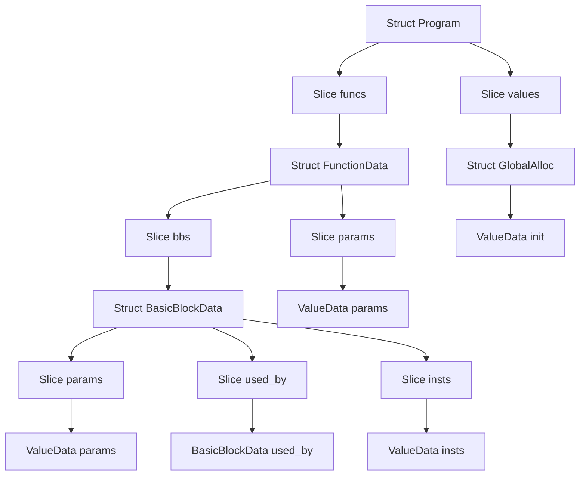

```mermaid
graph TD

prog[Struct Program] --> prog.values[Slice values];
prog --> prog.funcs[Slice funcs];

prog.funcs --> func[Struct FunctionData];
func --> func.params[Slice params];
func --> func.bbs[Slice bbs];

func.bbs --> bb[Struct BasicBlockData];
bb --> bb.params[Slice params];
bb --> bb.used_by[Slice used_by];
bb --> bb.insts[Slice insts];

prog.values --> globAlloc[Struct GlobalAlloc];
globAlloc --> globAlloc.init[ValueData init];

func.params --> funcArgRef[ValueData params];

bb.params --> blockArgRef[ValueData params];

bb.used_by --> bbdata[BasicBlockData used_by];

bb.insts --> valueData[ValueData insts];
```